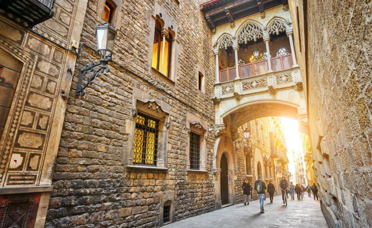

<script> 
    $(document).ready(function() { 
    $head = $('#header'); 
    $head.prepend('<A href = https://www.cuttingedge-events.com></A>') 
    }); 
</script> 


```{r setup, include=FALSE}
knitr::opts_chunk$set(echo = FALSE, message=FALSE, warning=FALSE)
```


```{r libraries}
library(readxl)
library(dplyr)
library(knitr)
library(timevis)

```


## SUGGESTED ACTIVITIES{.tabset .tabset-fade .tabset-pills}

### **Montserrat tour** 

Have you ever heard about Montserrat Abbey? It has a really long history. It was built on 1025! It has almost 1.000 year history. Montserrat Abbey was a strategic zone during the wars on the 17th and 18th century, as well as during the Spanish civil war,  so clergy had to leave the Monastery as it was occuped by the military forces.
Montserrat Abbey is located in a Mountain rage called Montserrat as well. In addition to the religious spirit that belongs itself, Montserrat hasa traditional legend since long time ago. Legend says that on the 11th century a group of shepherds saw a strong light up in the sky. Since then many people avouch that they have seen UFOs more than once
 
This is a full day tour. The tour starts in Barcelona, in the hotel where guests are acomodated, in this case in Port Vell, as guests will be accomodated in their yatches. 

The Montserrat tour includes: 

* **3 English speaking guides**

* **Whispers**

* **Bus at disposal**

* **Tickets for Montserrat museum and Montserrat Abbey**

* **Lunch at Mirador de Les Caves**

<br>

<iframe src="https://uploads.knightlab.com/storymapjs/ee2f18a9c1765fc1a4086f419505950c/montserrat-tour-mirador-de-les-caves-lunch/index.html" frameborder="0" width="100%" height="800"></iframe>

### **Gaudí tour**

Gaudí was one of the best-knwon architect in Barcelona. Their buildings still being a really tourist attraction and is the best artist of the "Catalan Modernism".
A fact you won't know is that 7 of his works has been declared a World Heritage by the UNESCO. However, a courious fact, is that his best and well-known work, La Sagrada Familia, is still under construction! It is expected to be finished by 2026... and it was started in 1882!!
Also, the Papa Benedicto XVI blessed the building in 2010 turning from "Cathedral" into "Basilica" and named the 21st century Basilica.

This activity includes:

* **3 English speaking guides**

* **Whispers**

* **Bus at disposal**

* **Tickets entrance to Sagrada Familia and Parc Güell**

* **Dinner at Cal Pinxo**

* **Park Güell bus parking**

<br>

<iframe src="https://uploads.knightlab.com/storymapjs/ee2f18a9c1765fc1a4086f419505950c/gaudi-tour/index.html" frameborder="0" width="100%" height="800"></iframe>

### **Old town tour**{.tabset .tabset-fade.}

Within Barcelona's Old Town, the political and geographic centre of the city is located. Starting 133 before Christ with the Romans, and the dominion of the Visigoths, the Moors and the crown of Aragon through the Spanish Civil War and the modern Barcelona.
This oldtown was enclosed by large walls during the Romans century and was restored by the Count of Barcelona. However, if you do a walk through it, you'll be able to see some constructions that remain well conserved, like the "Catedral de la Sant Creu i Santa Eulària", St. Jaume square, etc.

This tour includes:

* **3 English speaking guides**

* **Whispers** 

* *We can manage a stop in a bar of the zone to have a drink if requested*

Barcelona has two Old town quarters; Gothic quarter and El Born quarter.

#### **Gothic quarter**

Many narrow and winding alleys dominate the townscape of the Gothic district, the Barri Gòtic.



#### ** Born Quarter**

Directly to the east of the Gothic District, separated by the four-lane Via Leietana, is the neighborhood of "Sant Pere, Santa Caterina i la Ribera (El Born)." The southern part of the district "La Ribera" (El Born) is today famous for its many Bars, restaurants and clubs and is one of the hippest spots in Barcelona.


### **Abadal Winery**

This winery is located really close to Montserrat Mountains, at Penedés area.
This activity includes

* **Bus** 

* **Guide**

* **Winery visit** 

* **Wine tasting**

* **Exclusive space rental**

* **Lunch**

The activity will start with private tour of the **Masia Roqueta farmhouse**, which dates back to the **XII century**. The group will go deep into the basement of the house and explore its old cellar, which has been restored to its original state. It is the jewel in the crown of wine history and culture in this region. It is a tour that will take the group back in time. 

After this a **private tour of the winery and the wine-ageing cellar** where Abadal wines are made today and a uided tasting session of high-end Abadal wines. And we will finish the activity with a lunch in an exclusive venue. 


<br>


After the lunch, we will take our bus, which transfer the group back to Barcelona 

### **Indoor Karting**

As requested, we offer you a driving experience in Indoor Karting Barcelona.
A renewed look of Karting in Barcelona, where guests will enjoy of a competition in two different groups. It was declared as the best Indoor Karting in Spain and included in the TOP-10 of Europe. You'll feel you are driving a real F-1 car, as it has some curves that simulates the F-1 circuits *Spa-Francorchaps* and *Indianapolis*! And if you combine it with our speaker you'll feel you are Lewis Hamilton!

As 30 people is a really big group to compete at the same time we will divide the group in 2 groups of 15 people each. 
The **Grand Prix** is an individual and competitive race. The event has a practice session + qualifiers session + race with starting lines. 
The group will have the track in exclusivisity and will be completely personalized! There will be an speaker retransmitting the race and a celebration in the podium with cava and trophies for the winners. 

This activity includes:

* **Bus at disposal**

* **Race organisation**

* **Podium with cava and trophies**


<br>


### **La Roca Village shopping experience**

La Roca Village is the main shopping spot in Catalonia.This shopping center features more than 140 shops and more than 160 clothing brands! The place is a large street that simulates an samll town, full of small squares with trees and *small houses* filled with all kind of clothes! Besides the shopping experience it is also a claim for the tourists because, as we told, it is a really nice place to visit and shopping!

**_Our clients will have free access exceptionally to the VIP Lounge and will be received with a glass of cava, hands free shopping service inclusive_** 


<br>

Guests will have fre time to spend their money with the most fashion clothes during 2 hours. After this, they will have a lunch booked at restaurant *Pasarela* located inside the village. 

This activity includes:

* **Bus at disposal**
* **Lunch at restaurant Pasarela**


<br>


## EVENING OPTION

### La Pedrera Night Experience

There is the possibility to have a night experience in La Pedrera. 
LA Pedrera - Casa Milà features the possibility to combine the stunning night view with a cocktail or dinner at 4Gats o Gaudí's room of La Pedrera. What else can improve your stay if Barcelona if not this?! Completely exclusive, you'll enjoy your dinner and the lights show in the middle of Passeig de Gracia and in the top of this Gaudí's monument.
They do this as public, but there is the possibility to privatise it. 
This experience includes:

* **Meet and greet with a guide at Flowers Garden of Passeig de Gràcia**

* **Guided visit (20 minutes) of the rooftop **

* **Music and lights show in Los Guerreros terrace**

* **Glass of Cava in Patio "Las Mariposas de Provenza"**

* **Possibility to enjoy a dinner before or after the light show**

* **Rental space** 

 

 

### Soho House Night

Enjoy a lovely evening at Soho House Barcelona! Soho House is a 5*hotel. There is a VIP private club, which is one of the most exclusive in the world! It belongs to the hotel, and it is really difficult to join it. Some famous people like Beckham family, Rihanna, Cristiano Ronaldo and Elton John had been seen in some of the 18 clubs that belong to this brand. Miami, Chicago, New York, London and Barcelona are some of the spots this clubs are located. 

What we offer you is a "Night in this hotel". As this is a private club, some of the areas are completely restricted, as are only allowed for those who are members.
During this night, the group will have La Mercé room in exclusivity for them. La Mercé room featrues a lot of artworks with a marble bar. 

Included:

* **Rental of La Mercé room 20h-00h**
* **Drink package / open bar**


*****

## Budget

<iframe src="https://esb20190015budget.netlify.com/"  frameborder="0" width="100%" height="1600" scrolling="no"></iframe>

<br>

## Terms & Conditions

  * Rates valid for 2019. For 2020 we expect an increase in the rates around 3%
  
  * For a group of minimum 30 pax.
  
  * Cutting Edge Events management fee including in the detailed rates
  
  * VAT included. 
  
  * No reservation has been done. Availability upon request.
  
  * Proposal offered by Diana Llorca and Cutting Edge Events 

## Amaze your clients!!

<div class="client_offer">

<p>Didn't you just love our presentation ? Our first goal here at _**Cutting Edge Events**_ is to help you **win** this business. You will most likely now collate the information contained in this website and make your own presentation
to show your client<br>

<p>Why not leverage our technology, and present your client with the same format ? As a **totally free service**, we offer you the possibility of doing the work for you</p>

<p> We will: 
  <ul>
    * Follow your instructions to add anything you want to be in your presentation, and delete anything that you don't consider relevant
    * Include your logo and company details, and remove all our company details
    * We can even change some colors to mimic your corporate identity
    * We will send you the new link, and it will look as if it was your work
  </ul>
</p>
</div>

<style>

.client_offer{
background-color: blue;
color: white;
padding: 10px;
border: 1px solid black;
margin-left: 25px;
border-radius: 5px;
font-style: italic;
}
</style>

******************


