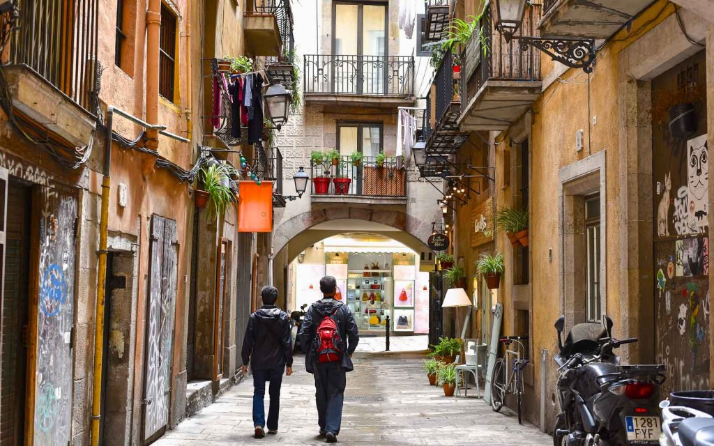
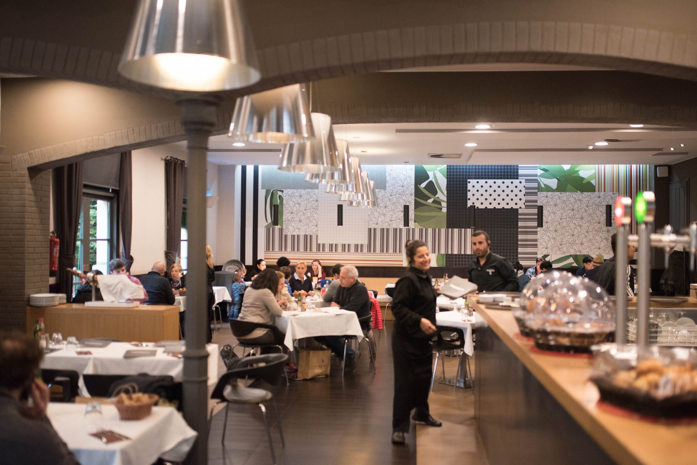

<script> 
    $(document).ready(function() { 
    $head = $('#header'); 
    $head.prepend('<A href = https://www.cuttingedge-events.com></A>') 
    }); 
</script> 


```{r setup, include=FALSE}
knitr::opts_chunk$set(echo = FALSE, message=FALSE, warning=FALSE)
```


```{r libraries}
library(readxl)
library(dplyr)
library(knitr)
library(timevis)

```


## SUGGESTED ACTIVITIES{.tabset .tabset-fade .tabset-pills}

### **Montserrat tour** 

This is a full day tour. The tour starts in Barcelona, in the hotel where guests are acomodated, in this case in Port Vell, as guests will be accomodated in their yatches. 

The Montserrat tour includes: 

* **3 English speaking guides**

* **Whispers**

* **Bus at disposal**

* **Tickets for Montserrat museum and Montserrat Abbey**

* **Lunch at Mirador de Les Caves**

<br>

<iframe src="https://uploads.knightlab.com/storymapjs/ee2f18a9c1765fc1a4086f419505950c/montserrat-tour-mirador-de-les-caves-lunch/index.html" frameborder="0" width="100%" height="800"></iframe>

### **Gaudí tour**

Gaudí was one of the best-knwon architect in Barcelona. Their buildings still being a really tourist attraction. 

This activity includes:

* **3 English speaking guides**

* **Whispers**

* **Bus at disposal**

* **Tickets entrance to Sagrada Familia and Parc Güell**

* **Dinner at Cal Pinxo**

* **Park Güell bus parking**

<br>

<iframe src="https://uploads.knightlab.com/storymapjs/ee2f18a9c1765fc1a4086f419505950c/gaudi-tour/index.html" frameborder="0" width="100%" height="800"></iframe>

### **Old town tour**{.tabset .tabset-fade.}

Within Barcelona's Old Town, the political and geographic centre of the city is located. Starting 133 before Christ with the Romans, and the dominion of the Visigoths, the Moors and the crown of Aragon through to the Spanish Civil War and the modern Barcelona.

This tour includes:

* **3 English speaking guides**

* **Whispers** 

* *We can manage a stop in a bar of the zone to have a drink if requested*

Barcelona has two Old town quarters; Gothic quarter and El Born quarter.

#### **Gothic quarter**

Many narrow and winding alleys dominate the townscape of the Gothic district, the Barri Gòtic.


#### ** Born Quarter**

Directly to the east of the Gothic District, separated by the four-lane Via Leietana, is the neighborhood of "Sant Pere, Santa Caterina i la Ribera (El Born)." The southern part of the district "La Ribera" (El Born) is today famous for its many Bars, restaurants and clubs and is one of the hippest spots in Barcelona.



### **Abadal Winery**

This winery is located really close to Montserrat Mountains, at Penedés area.
This activity includes

* **Bus** 

* **Guide**

* **Winery visit** 

* **Wine tasting**

* **Exclusive space rental**

* **Lunch**

The activity will start with private tour of the **Masia Roqueta farmhouse**, which dates back to the **XII century**. The group will go deep into the basement of the house and explore its old cellar, which has been restored to its original state. It is the jewel in the crown of wine history and culture in this region. It is a tour that will take the groui back in time 

After this a **private tour of the winery and the wine-ageing cellar** where Abadal wines are made today and a uided tasting session of high-end Abadal wines. And we will finish the activity with a lunch in an exclusive venue. 


<br>


After the lunch, we will take our bus, which transfer the group back to Barcelona 

### **Indoor Karting**

As requested, we offer you a driving experience in Indoor Karting Barcelona.
A renewed look of Karting in Barcelona, where guests will enjoy of a competition in two different groups.
As 30 is a really big group to compete at the same time we will divide the group in 2 groups of 15. 
The **Grand Prix** is an individual and competitive race. The event has a practice session + classificatories session + race with starting lines. 
The group will have the track in exclusivisity and will be completely personalized. There will be an speaker retransmitting the race and a celebration in the podium with cava and trophies for the winners. 

This activity includes:

* **Bus at disposal**

* **Race organisation**

* **Podium with cava and trophies**


<br>


### **La Roca Village shopping experience**

La Roca Village is the main shopping spot in Catalonia. An outlet with many shops in a really long street. 
Guests will have fre time to spend their money with the most fashion clothes during 2 hours. After this, they will have a lunch booked at restaurant *Pasarela* located inside the village. 

This activity includes:

* **Bus at disposal**
* **Lunch at restaurant Pasarela**


<br>



## EVENING OPTION

### La Pedrera Night Experience

There is the possibility to have a night experience in La Pedrera. 
LA Pedrera - Casa Milà features the possibility to combine the stunning night view with a cocktail or dinner at 4Gats o Gaudí's room of La Pedrera.
They do this as public, but there is the possibility to privatise it. 
This experience includes:

* **Meet and greet with a guide at Flowers Garden of Passeig de Gràcia**

* **Guided visit (20 minutes) of the rooftop **

* **Music and lights show in Los Guerreros terrace**

* **Glass of Cava in Patio "Las Mariposas de Provenza"**

* **Possibility to enjoy a dinner before or after the light show**

* **Rental space** 

 

 

*****

## Budget

<iframe src="https://esb20190015budget.netlify.com/"  frameborder="0" width="100%" height="1600" scrolling="no"></iframe>

<br>

## Terms & Conditions

  * Rates valid for 2019. For 2020 we expect an increase in the rates around 3%
  
  * For a group of minimum 30 pax.
  
  * Cutting Edge Events management fee including in the detailed rates
  
  * VAT included. 
  
  * No reservation has been done. Availability upon request.
  
  * Proposal offered by Diana Llorca and Cutting Edge Events 

## Amaze your clients!!

<div class="client_offer">

<p>Didn't you just love our presentation ? Our first goal here at _**Cutting Edge Events**_ is to help you **win** this business. You will most likely now collate the information contained in this website and make your own presentation
to show your client<br>

<p>Why not leverage our technology, and present your client with the same format ? As a **totally free service**, we offer you the possibility of doing the work for you</p>

<p> We will: 
  <ul>
    * Follow your instructions to add anything you want to be in your presentation, and delete anything that you don't consider relevant
    * Include your logo and company details, and remove all our company details
    * We can even change some colors to mimic your corporate identity
    * We will send you the new link, and it will look as if it was your work
  </ul>
</p>
</div>

<style>

.client_offer{
background-color: blue;
color: white;
padding: 10px;
border: 1px solid black;
margin-left: 25px;
border-radius: 5px;
font-style: italic;
}
</style>

******************


